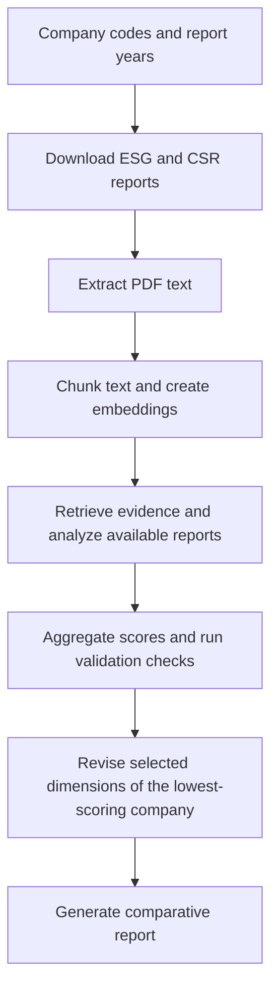

# ESG/CSR Agentic Analysis System

An AI-assisted system for comparing environmental, social, and governance (ESG) and corporate social responsibility (CSR) reports from Taiwan-listed companies. It retrieves reports, analyzes their disclosures, and generates a comparative report with targeted recommendations for the lowest-scoring company.

Developed as a course project for **AI Aid in Business Problem Solving**.

## Overview

Reviewing sustainability reports across companies requires collecting documents, locating relevant evidence, and applying a consistent evaluation framework. This project combines a staged agent workflow with retrieval-augmented generation (RAG): relevant passages from the reports are retrieved to support model-generated analysis.

The command-line interface and generated analysis use Chinese. The default workflow compares at least **three companies**, identified by their Taiwan stock codes.

### Key features

- **Report collection:** Downloads available ESG and CSR PDFs from [TWSE ESG+](https://esggenplus.twse.com.tw/) and [MOPS](https://mops.twse.com.tw/).
- **Document retrieval:** Extracts PDF text, creates multilingual embeddings, and stores searchable chunks locally in ChromaDB.
- **Structured analysis:** Evaluates ESG and CSR dimensions with findings, quantitative metrics, rubric scores, confidence scores, and improvement suggestions.
- **Comparative scoring:** Aggregates rubric scores across available analyses and identifies the lowest-scoring company.
- **Targeted revision:** Uses Gemini to deepen the analysis of selected weak dimensions for that company.
- **Report generation:** Produces a combined report with company comparisons, individual analyses, and the targeted revision, with Markdown and pipeline-state records retained locally.

## How it works



The pipeline attempts both report types, but a company needs only one available type. ESG analysis covers environmental, social, and governance disclosures. CSR analysis covers stakeholder engagement, material topics, community investment, employee relations, and environmental stewardship.

Dimensions use five rubric criteria: framework compliance, data completeness, materiality analysis, targets and commitments, and external assurance. The default weak-score threshold is **5 out of 10**. If no dimension falls below that threshold, the pipeline selects the lowest-scoring dimensions for revision.

### Technology

| Component | Implementation |
| --- | --- |
| Workflow | Python pipeline with CrewAI agent definitions |
| Initial analysis | OpenAI by default; Anthropic key detection is also supported |
| Revision | Google Gemini |
| PDF text extraction | pdfplumber |
| Embeddings | Sentence Transformers with `intfloat/multilingual-e5-large` by default |
| Vector storage | Local ChromaDB |
| Report rendering | Markdown and WeasyPrint, with a ReportLab fallback |

## Getting started

### Requirements

- Python **3.10 or newer**, with `pip` and `venv` support. Dependencies may impose additional Python-version constraints.
- Git to clone the repository.
- An OpenAI API key and a Google Gemini API key for the default configuration. The CLI requires both keys before starting.
- Internet access for report downloads, model API calls, and the initial embedding-model download.
- For full PDF styling, the [system libraries required by WeasyPrint](https://doc.courtbouillon.org/weasyprint/stable/first_steps.html#installation) and a Traditional Chinese font such as Noto Sans TC.

### Installation

The following commands use a POSIX shell on Linux or macOS:

```bash
git clone https://github.com/marktsai321/ESG_CSR_agentic_analysis_system.git
cd ESG_CSR_agentic_analysis_system

python3 -m venv .venv
source .venv/bin/activate
python -m pip install --upgrade pip
python -m pip install -e .

cp .env.example .env
```

Edit `.env` and replace the API-key placeholders:

```dotenv
OPENAI_API_KEY=your-openai-api-key
OPENAI_MODEL_NAME=gpt-4o
GEMINI_API_KEY=your-gemini-api-key
REVISION_MODEL_NAME=gemini-2.5-flash
EMBEDDING_MODEL_NAME=intfloat/multilingual-e5-large
VECTOR_STORE_BACKEND=chromadb
CONFIDENCE_THRESHOLD=0.6
```

Run commands from the repository root so `.env` and generated data use the expected locations. The application creates its data directories automatically.

### Run an analysis

Pass at least three company codes and one or more report years:

```bash
esg-csr-agent --companies 2330 2317 2454 --years 2023
```

For interactive prompts, run:

```bash
esg-csr-agent
```

The Python module entry point is also available:

```bash
python -m esg_csr_agent --companies 2330 2317 2454 --years 2023
```

These examples use Taiwan Semiconductor Manufacturing Company (`2330`), Hon Hai Precision Industry (`2317`), and MediaTek (`2454`). Report availability depends on the company, year, and source platform.

## Configuration

Settings are loaded from environment variables or the root `.env` file. See [`.env.example`](.env.example) for the starter configuration and [`config.py`](src/esg_csr_agent/config.py) for all defaults.

| Variable | Default | Purpose |
| --- | --- | --- |
| `OPENAI_API_KEY` | Required | API key for initial analysis |
| `OPENAI_MODEL_NAME` | `gpt-4o` | OpenAI analysis model |
| `GEMINI_API_KEY` | Required | API key for the revision stage |
| `REVISION_MODEL_NAME` | `gemini-2.5-flash` | Gemini revision model |
| `EMBEDDING_MODEL_NAME` | `intfloat/multilingual-e5-large` | Local multilingual embedding model |
| `VECTOR_STORE_BACKEND` | `chromadb` | Vector-store backend; ChromaDB is currently the only implementation |
| `CONFIDENCE_THRESHOLD` | `0.6` | Minimum confidence used by validation checks |
| `WEAK_SCORE_THRESHOLD` | `5` | Rubric-score threshold for selecting weak dimensions |

For Anthropic analysis, the current implementation detects an `sk-ant-` key supplied through `OPENAI_API_KEY`. It then uses `ANTHROPIC_MODEL_NAME`, which defaults to `claude-sonnet-4-20250514`. A Gemini key is still required for revision.

## Outputs

The final report includes:

1. **Comparative score summary:** Company totals and dimension-level rubric scores.
2. **Per-company analysis:** Findings, metrics, confidence scores, and improvement suggestions.
3. **Targeted revision:** A deeper review of selected dimensions for the lowest-scoring company.

| Location | Contents |
| --- | --- |
| `data/raw_pdfs/esg/`, `data/raw_pdfs/csr/` | Downloaded source reports |
| `data/extracted_text/` | Extracted text with page markers |
| `data/vector_store/` | Persistent ChromaDB data |
| `data/analysis/` | Analysis JSON files by company, year, and report type |
| `data/revised/` | Revision Markdown and combined report Markdown |
| `data/revised_pdfs/` | Final reports named `{run_id}_{year_suffix}.pdf` |
| `logs/` | Download-failure records and `pipeline_state_{run_id}.json` |

The CLI prints the final report path and validation summary. If WeasyPrint fails, the system tries ReportLab; if both PDF renderers fail, it saves an HTML report instead.

## Repository structure

```text
.
├── README.md
├── CLAUDE.md                   # Agent design notes and development guidance
├── .env.example               # Configuration template
├── pyproject.toml             # Package metadata and dependencies
├── setup.sh                   # Shell setup helper
└── src/esg_csr_agent/
    ├── main.py                # Interactive and direct CLI entry points
    ├── config.py              # Environment settings and data paths
    ├── pipeline_state.py      # Shared pipeline state
    ├── llm_client.py          # Model-provider integration
    ├── download_reports.py    # Unified report downloader
    ├── download_esg_pdfs.py   # TWSE ESG+ downloader
    ├── download_csr_pdfs.py   # MOPS downloader
    ├── report_utils.py        # Shared download and path utilities
    ├── vector_store.py        # Vector-store interface and ChromaDB backend
    └── agents/                # Orchestration, analysis, revision, and delivery
```

## Current limitations

- **Text-based PDFs:** Extraction uses pdfplumber. Scanned, image-only PDFs need OCR preprocessing; the current extraction stage does not perform OCR.
- **Report availability:** Source-platform changes or unavailable reports can prevent downloads. CSR-branded reports may be unavailable for more recent years.
- **Score comparability:** Totals sum the available rubric scores across report types and years without normalization. Comparisons are most meaningful when report coverage is consistent across companies.
- **Validation behavior:** Failed validation checks are recorded, but the current pipeline can still proceed to revision and report generation. Review the validation summary and failure records alongside the report.
- **Cached results:** Several stages reuse existing files or vector-store entries. Changing model settings does not automatically refresh previously generated results.

## Contributing

Use [GitHub Issues](https://github.com/marktsai321/ESG_CSR_agentic_analysis_system/issues) to report reproducible problems or suggest improvements. Include the relevant command, Python version, report year, company codes, and error details. For proposed changes, describe the scope and verification steps in a pull request.

## License

The package metadata in [`pyproject.toml`](pyproject.toml) declares MIT. This repository does not currently include a standalone `LICENSE` file.
